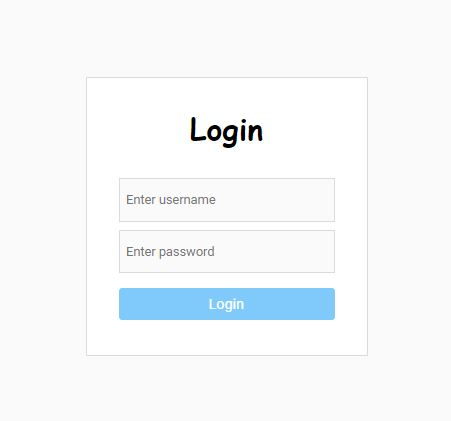

# Login With Tests
An authentication Tests project whose goal was to learn and experiment with tests.



## About the tests
So to create my small refference for tests, I chosed to implement it on the Login page. 
I built tests for the user service, user action and user reducer files and functions.

I used jest amazing gifts, such as render, screen and user event in order to simulate a real DOM and user actions, and to see if it is indeed follow my expectations.

#### Technologies

- React
- React-Router
- Redux
- Jest
- Sass
- React CLI & Github pages


## Getting started
Clone the project or dowload the files on top.
```
git clone https://github.com/TalElmaliachHemo/login-with-tests.git
```
Open the terminal and enter the following line to run it locally on your computer:
```
npm i
npm start 
```
Runs the app in the development mode.
Open http://localhost:3000 to view it in the browser (it is supposed to happen automatically).

Now, to see some tests, run this line:
```
npm run test 
```

You supposed to see that the tests are running (in the terminal), and all of them should be passed.
